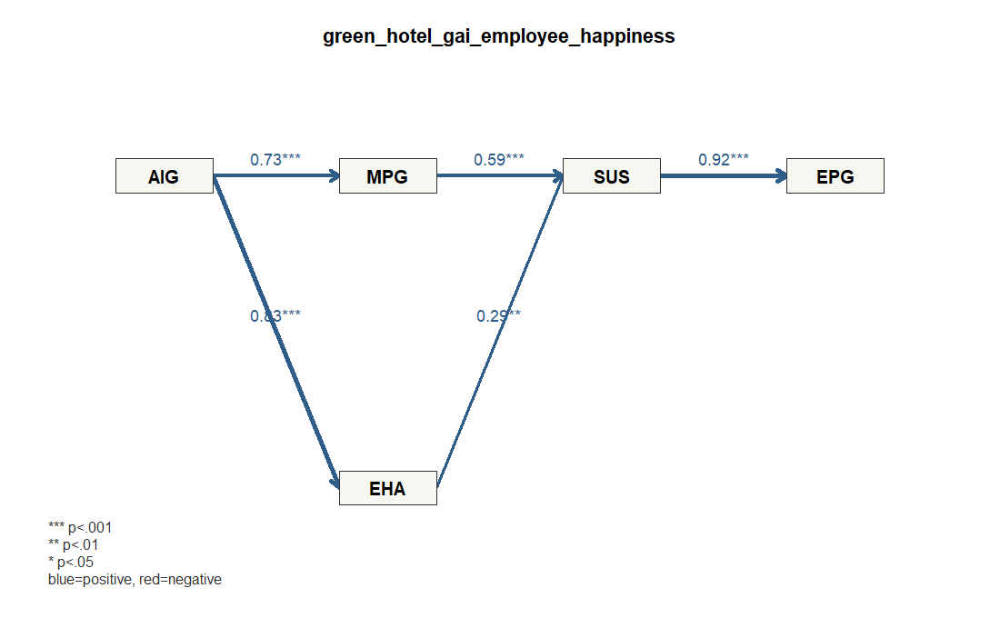

# Demo 5: グリーンホテルの生成AI、社員幸福、環境パフォーマンス

## データ

- Dataset ID: `green_hotel_gai_employee_happiness`
- Source: https://data.mendeley.com/datasets/999m5mhdkx
- License: CC BY 4.0 (https://creativecommons.org/licenses/by/4.0/)
- 分析に使った有効行数: 219
- ブートストラップ回数: 300

## モデル

`AIG` を生成AI活用、`EHA` を社員幸福、`SUS`/`EPG` を持続可能性・環境成果として扱う探索モデルです。

### 測定ブロック

- `AIG`: `AIG1`, `AIG2`, `AIG3`, `AIG4`
- `MPG`: `MPG1`, `MPG2`, `MPG3`, `MPG4`
- `EHA`: `EHA1`, `EHA2`, `EHA3`, `EHA4`, `EHA5`
- `SUS`: `SUS1`, `SUS2`, `SUS3`, `SUS4`, `SUS5`
- `EPG`: `EPG1`, `EPG2`, `EPG3`, `EPG4`, `EPG5`

### 構造パス

- `AIG` -> `MPG`
- `AIG` -> `EHA`
- `MPG` -> `SUS`
- `EHA` -> `SUS`
- `SUS` -> `EPG`

### パス図



## 信頼性・妥当性の要約

```text
 block alpha composite_reliability   ave
   AIG 0.786                 0.863 0.613
   MPG 0.861                 0.906 0.706
   EHA 0.854                 0.896 0.634
   SUS 0.804                 0.867 0.571
   EPG 0.828                 0.877 0.588
```

### ローディング要約

```text
 block min_loading mean_loading max_loading items
   AIG       0.662        0.780       0.834     4
   EHA       0.697        0.795       0.851     5
   EPG       0.696        0.765       0.847     5
   MPG       0.775        0.839       0.883     4
   SUS       0.609        0.748       0.850     5
```

## 構造モデル

### パス係数

```text
       path  beta
 AIG_to_MPG 0.725
 AIG_to_EHA 0.828
 MPG_to_SUS 0.593
 EHA_to_SUS 0.288
 SUS_to_EPG 0.922
```

### ブートストラップ

```text
       path  beta boot_se t_value p_value_approx
 AIG_to_MPG 0.725   0.035  20.709          0.000
 AIG_to_EHA 0.828   0.027  30.658          0.000
 MPG_to_SUS 0.593   0.079   7.480          0.000
 EHA_to_SUS 0.288   0.087   3.319          0.001
 SUS_to_EPG 0.922   0.007 125.129          0.000
```

### R2

```text
 construct r_squared
       MPG     0.526
       EHA     0.685
       SUS     0.727
       EPG     0.850
```

## 結果の短い読み取り

- 最も大きい有意パスは `SUS_to_EPG` (β=0.922, p≈0.000) でした。
- 5%水準で有意だったパス: `SUS_to_EPG` (β=0.922), `AIG_to_EHA` (β=0.828), `AIG_to_MPG` (β=0.725), `MPG_to_SUS` (β=0.593), `EHA_to_SUS` (β=0.288)。
- 有意でなかったパス: なし。
- 説明力が最も高い内生構成概念は `EPG` (R2=0.850) です。
- AVEはすべて0.50以上で、測定ブロックは概ね解釈しやすい水準です。

## メモ

- このデモは `lvsem` の軽量ワークフローに合わせ、測定項目から潜在変数スコアを作成し、構造パスを標準化回帰として推定しています。
- 欠損や非数値は、指定した測定項目を数値化したうえで完全ケースのみを使いました。
- 研究論文の厳密な再現ではなく、`lvsemEnterpriseData` に収録した企業・組織内データの利用例です。

