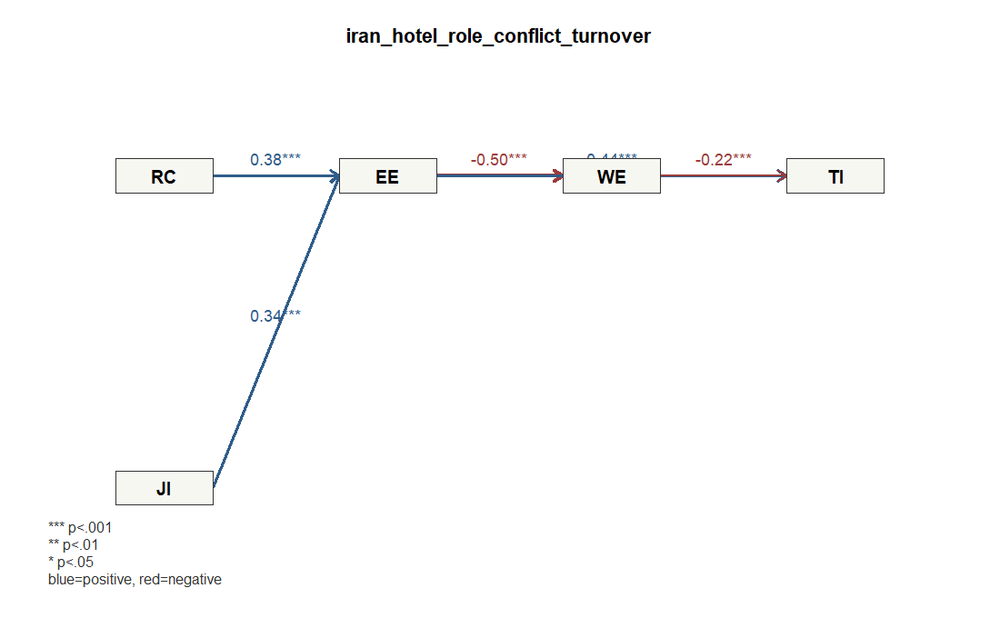

# Demo 4: ホテル従業員の役割葛藤、不安定雇用、情緒的消耗、ワークエンゲージメント、離職意図

## データ

- Dataset ID: `iran_hotel_role_conflict_turnover`
- Source: https://data.mendeley.com/datasets/tbmzzsz6m3/2
- License: CC BY 4.0 (https://creativecommons.org/licenses/by/4.0/)
- 分析に使った有効行数: 297
- ブートストラップ回数: 300

## 研究背景

ホテル従業員は、顧客対応、上司の要求、勤務スケジュールなど複数の圧力にさらされやすく、 役割葛藤や雇用不安はバーンアウトや離職意図につながる可能性があります。 このデモでは、役割葛藤と不安定雇用が情緒的消耗を高め、 ワークエンゲージメントと離職意図にどう波及するかを見ます。

## モデル

`RC` と `JI` が情緒的消耗を高め、ワークエンゲージメントと離職意図に波及するモデルです。

### 測定ブロック

- `RC`: `RC 1`, `RC 2`, `RC 3`, `RC 4`, `RC 5`, `RC 6`, `RC 7`, `RC 8`
- `JI`: `JI 1`, `JI 2`, `JI 3`
- `EE`: `EE 1`, `EE 2`, `EE 3`, `EE 4`, `EE 5`, `EE 6`
- `WE`: `WE 1`, `WE 2`, `WE 3`
- `TI`: `TI 1`, `TI 2`, `TI 3`, `TI 4`, `TI 5`

### 構造パス

- `RC` -> `EE`
- `JI` -> `EE`
- `EE` -> `WE`
- `EE` -> `TI`
- `WE` -> `TI`

### パス図



## 信頼性・妥当性の要約

```text
 block alpha composite_reliability   ave
    RC 0.785                 0.840 0.400
    JI 0.854                 0.911 0.774
    EE 0.859                 0.895 0.587
    WE 0.850                 0.909 0.768
    TI 0.613                 0.843 0.709
```

### ローディング要約

```text
 block min_loading mean_loading max_loading items
    EE       0.711        0.765       0.827     6
    JI       0.860        0.880       0.906     3
    RC       0.514        0.628       0.728     8
    TI      -0.696        0.560       0.915     5
    WE       0.865        0.876       0.891     3
```

## 構造モデル

### パス係数

```text
     path   beta
 RC_to_EE  0.376
 JI_to_EE  0.340
 EE_to_WE -0.500
 EE_to_TI  0.444
 WE_to_TI -0.217
```

### ブートストラップ

```text
     path   beta boot_se t_value p_value_approx
 RC_to_EE  0.376   0.048   7.778              0
 JI_to_EE  0.340   0.049   7.017              0
 EE_to_WE -0.500   0.046  10.978              0
 EE_to_TI  0.444   0.051   8.712              0
 WE_to_TI -0.217   0.054   3.981              0
```

### R2

```text
 construct r_squared
        EE     0.331
        WE     0.250
        TI     0.340
```

## 結果の短い読み取り

- いちばん強い関係は、情緒的消耗が高いほど低くなる方向でワークエンゲージメントも高い傾向でした (β=-0.500)。
- はっきりした関係として読めるものは、情緒的消耗が高いほど低くなる方向でワークエンゲージメントも高い傾向 (β=-0.500)、情緒的消耗が高いほど離職意図も高い傾向 (β=0.444)、役割葛藤が高いほど情緒的消耗も高い傾向 (β=0.376)、雇用不安が高いほど情緒的消耗も高い傾向 (β=0.340)、ワークエンゲージメントが高いほど低くなる方向で離職意図も高い傾向 (β=-0.217)です。
- 一方で、今回のデータでは明確とは言いにくい関係は、なしです。
- モデルが最もよく説明できているのは離職意図で、ばらつきの約34%をこのモデルで説明しています (R2=0.340)。
- 一部の質問項目のまとまりは少し弱めです: 役割葛藤 (AVE=0.400)。この部分は結果を少し慎重に読む必要があります。

## 簡単な考察

役割葛藤と雇用不安はいずれも情緒的消耗と明確に関係しており、職場ストレス要因が消耗感に結びつく構図が確認できます。 情緒的消耗から離職意図への関係は正である一方、ワークエンゲージメントから離職意図への関係は負になり、 消耗は離職意図を高め、エンゲージメントは離職意図を抑える方向に働いています。 ホテル業の従業員ウェルビーイングを扱う場合、役割設計や雇用不安の軽減だけでなく、 エンゲージメントを支える施策も重要だと読むことができます。

## メモ

- このデモは `lvsem` の軽量ワークフローに合わせ、測定項目から潜在変数スコアを作成し、構造パスを標準化回帰として推定しています。
- 欠損や非数値は、指定した測定項目を数値化したうえで完全ケースのみを使いました。
- 研究論文の厳密な再現ではなく、`lvsemEnterpriseData` に収録した企業・組織内データの利用例です。

