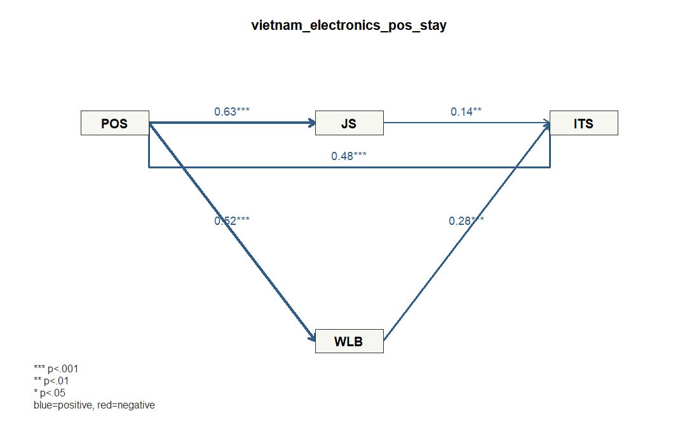

# Demo 2: 電子産業における組織支援、職務満足、WLB、定着意図

## データ

- Dataset ID: `vietnam_electronics_pos_stay`
- Source: https://data.mendeley.com/datasets/pyjkvgjmfz/2
- License: CC BY 4.0 (https://creativecommons.org/licenses/by/4.0/)
- 分析に使った有効行数: 604
- ブートストラップ回数: 300

## 研究背景

製造業、とくに電子産業では、従業員の定着が技能蓄積や品質安定に直結します。 組織から支援されているという認知は、職務満足やワークライフバランスを通じて、 離職ではなく定着を選ぶ心理に影響すると考えられます。 このデモでは、組織支援を起点にした定着意図モデルを扱います。

## モデル

`POS` が職務満足とワークライフバランスを高め、それらが定着意図に影響するモデルです。

### 測定ブロック

- `POS`: `POS1`, `POS2`, `POS3`, `POS4`, `POS5`, `POS6`, `POS7`, `POS8`
- `JS`: `JS1`, `JS2`, `JS3`, `JS4`, `JS5`
- `WLB`: `WLB1`, `WLB2`, `WLB3`
- `ITS`: `ITS1`, `ITS2`, `ITS3`, `ITS4`, `ITS5`

### 構造パス

- `POS` -> `JS`
- `POS` -> `WLB`
- `POS` -> `ITS`
- `JS` -> `ITS`
- `WLB` -> `ITS`

### パス図



## 信頼性・妥当性の要約

```text
 block alpha composite_reliability   ave
   POS 0.911                 0.928 0.617
    JS 0.850                 0.893 0.625
   WLB 0.759                 0.861 0.674
   ITS 0.879                 0.912 0.674
```

### ローディング要約

```text
 block min_loading mean_loading max_loading items
   ITS       0.800        0.821       0.851     5
    JS       0.748        0.790       0.833     5
   POS       0.757        0.785       0.818     8
   WLB       0.807        0.821       0.843     3
```

## 構造モデル

### パス係数

```text
       path  beta
  POS_to_JS 0.626
 POS_to_WLB 0.525
 POS_to_ITS 0.478
  JS_to_ITS 0.139
 WLB_to_ITS 0.280
```

### ブートストラップ

```text
       path  beta boot_se t_value p_value_approx
  POS_to_JS 0.626   0.043  14.547          0.000
 POS_to_WLB 0.525   0.048  10.960          0.000
 POS_to_ITS 0.478   0.060   7.919          0.000
  JS_to_ITS 0.139   0.052   2.674          0.008
 WLB_to_ITS 0.280   0.045   6.179          0.000
```

### R2

```text
 construct r_squared
        JS     0.392
       WLB     0.276
       ITS     0.603
```

## 結果の短い読み取り

- いちばん強い関係は、組織支援が高いほど職務満足も高い傾向でした (β=0.626)。
- はっきりした関係として読めるものは、組織支援が高いほど職務満足も高い傾向 (β=0.626)、組織支援が高いほどワークライフバランスも高い傾向 (β=0.525)、組織支援が高いほど定着意図も高い傾向 (β=0.478)、ワークライフバランスが高いほど定着意図も高い傾向 (β=0.280)、職務満足が高いほど定着意図も高い傾向 (β=0.139)です。
- 一方で、今回のデータでは明確とは言いにくい関係は、なしです。
- モデルが最もよく説明できているのは定着意図で、ばらつきの約60%をこのモデルで説明しています (R2=0.603)。
- 各構成概念の質問項目はおおむね同じ概念を測れており、測定面では大きな問題は見えません。

## 簡単な考察

組織支援から職務満足とワークライフバランスへの関係が大きく、さらに定着意図への直接的な関係も確認できました。 これは、従業員が組織から支えられていると感じること自体が、 満足や生活面のバランスを高めるだけでなく、定着意図にも直接関係することを示しています。 ITSのR2も高めで、定着意図を説明する実務的モデルとして分かりやすい結果です。 組織支援施策を評価する社内サーベイの例として使いやすいデモです。

## メモ

- このデモは `lvsem` の軽量ワークフローに合わせ、測定項目から潜在変数スコアを作成し、構造パスを標準化回帰として推定しています。
- 欠損や非数値は、指定した測定項目を数値化したうえで完全ケースのみを使いました。
- 研究論文の厳密な再現ではなく、`lvsemEnterpriseData` に収録した企業・組織内データの利用例です。

