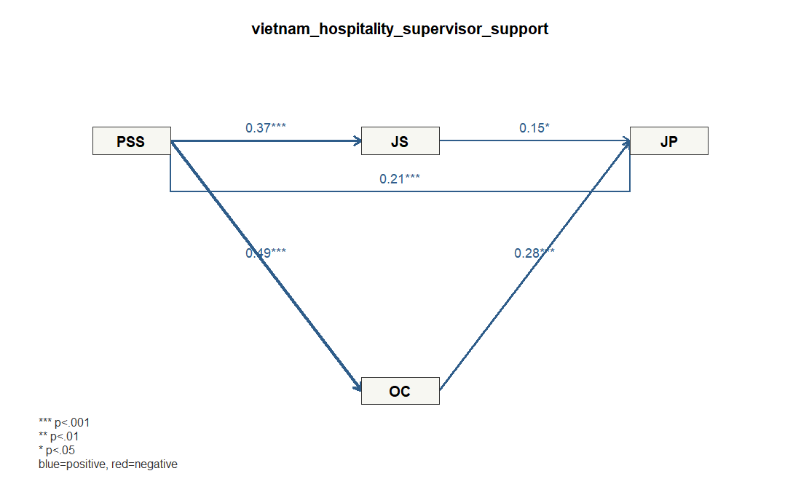

# Demo 3: ホスピタリティ従業員の上司支援、満足、コミットメント、職務パフォーマンス

## データ

- Dataset ID: `vietnam_hospitality_supervisor_support`
- Source: https://data.mendeley.com/datasets/c5dwcxwnyj/1
- License: CC BY 4.0 (https://creativecommons.org/licenses/by/4.0/)
- 分析に使った有効行数: 322
- ブートストラップ回数: 300

## モデル

`PSS` が職務満足と組織コミットメントを通じて職務パフォーマンスへ影響するモデルです。

### 測定ブロック

- `PSS`: `PSS1`, `PSS2`, `PSS3`, `PSS4`, `PSS5`
- `JS`: `JS1`, `JS2`, `JS3`, `JS4`, `JS5`
- `OC`: `OC1`, `OC2`, `OC3`, `OC4`, `OC5`
- `JP`: `JP1`, `JP2`, `JP3`

### 構造パス

- `PSS` -> `JS`
- `PSS` -> `OC`
- `PSS` -> `JP`
- `JS` -> `JP`
- `OC` -> `JP`

### パス図



## 信頼性・妥当性の要約

```text
 block alpha composite_reliability   ave
   PSS 0.821                 0.875 0.584
    JS 0.822                 0.875 0.584
    OC 0.773                 0.846 0.524
    JP 0.752                 0.858 0.669
```

### ローディング要約

```text
 block min_loading mean_loading max_loading items
    JP       0.803        0.818       0.833     3
    JS       0.734        0.764       0.782     5
    OC       0.647        0.723       0.766     5
   PSS       0.724        0.764       0.799     5
```

## 構造モデル

### パス係数

```text
      path  beta
 PSS_to_JS 0.373
 PSS_to_OC 0.489
 PSS_to_JP 0.214
  JS_to_JP 0.151
  OC_to_JP 0.281
```

### ブートストラップ

```text
      path  beta boot_se t_value p_value_approx
 PSS_to_JS 0.373   0.051   7.339          0.000
 PSS_to_OC 0.489   0.050   9.765          0.000
 PSS_to_JP 0.214   0.056   3.843          0.000
  JS_to_JP 0.151   0.059   2.547          0.011
  OC_to_JP 0.281   0.058   4.864          0.000
```

### R2

```text
 construct r_squared
        JS     0.139
        OC     0.239
        JP     0.266
```

## 結果の短い読み取り

- 最も大きい有意パスは `PSS_to_OC` (β=0.489, p≈0.000) でした。
- 5%水準で有意だったパス: `PSS_to_OC` (β=0.489), `PSS_to_JS` (β=0.373), `OC_to_JP` (β=0.281), `PSS_to_JP` (β=0.214), `JS_to_JP` (β=0.151)。
- 有意でなかったパス: なし。
- 説明力が最も高い内生構成概念は `JP` (R2=0.266) です。
- AVEはすべて0.50以上で、測定ブロックは概ね解釈しやすい水準です。

## メモ

- このデモは `lvsem` の軽量ワークフローに合わせ、測定項目から潜在変数スコアを作成し、構造パスを標準化回帰として推定しています。
- 欠損や非数値は、指定した測定項目を数値化したうえで完全ケースのみを使いました。
- 研究論文の厳密な再現ではなく、`lvsemEnterpriseData` に収録した企業・組織内データの利用例です。

