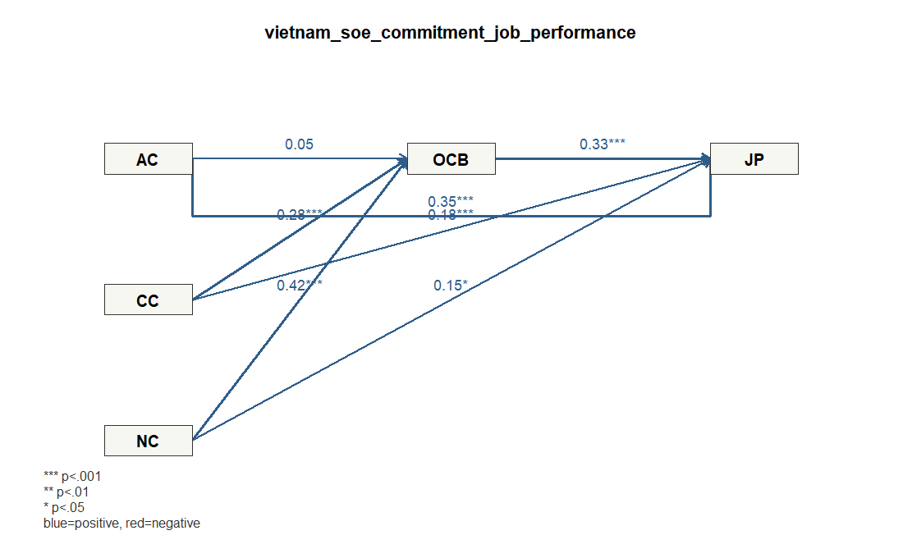

# Demo 1: ベトナム国営企業の組織コミットメント、OCB、職務パフォーマンス

## データ

- Dataset ID: `vietnam_soe_commitment_job_performance`
- Source: https://data.mendeley.com/datasets/tbjdwkzr57/2
- License: CC BY 4.0 (https://creativecommons.org/licenses/by/4.0/)
- 分析に使った有効行数: 336
- ブートストラップ回数: 300

## 研究背景

国営企業では、従業員の組織コミットメントが日常業務のパフォーマンスだけでなく、 公式な職務範囲を越えた組織市民行動にも結びつく可能性があります。 このデモでは、情緒的コミットメント、継続的コミットメント、規範的コミットメントを分け、 それらがOCBと職務パフォーマンスにどう関係するかを確認します。

## モデル

`AC`, `CC`, `NC` を組織コミットメントの側面として扱い、OCBを経由して職務パフォーマンスに影響するモデルです。

### 測定ブロック

- `AC`: `AC1`, `AC2`, `AC3`, `AC4`, `AC5`, `AC6`
- `CC`: `CC1`, `CC2`, `CC3`, `CC4`, `CC5`, `CC6`
- `NC`: `NC1`, `NC2`, `NC3`, `NC4`, `NC5`, `NC6`
- `OCB`: `OCB1`, `OCB2`, `OCB3`, `OCB4`, `OCB5`, `OCB6`, `OCB7`, `OCB8`
- `JP`: `JP1`, `JP2`, `JP3`, `JP4`

### 構造パス

- `AC` -> `OCB`
- `CC` -> `OCB`
- `NC` -> `OCB`
- `AC` -> `JP`
- `CC` -> `JP`
- `NC` -> `JP`
- `OCB` -> `JP`

### パス図



## 信頼性・妥当性の要約

```text
 block alpha composite_reliability   ave
    AC 0.947                 0.958 0.792
    CC 0.960                 0.968 0.835
    NC 0.922                 0.939 0.720
   OCB 0.908                 0.925 0.609
    JP 0.833                 0.889 0.669
```

### ローディング要約

```text
 block min_loading mean_loading max_loading items
    AC       0.798        0.889       0.925     6
    CC       0.881        0.914       0.945     6
    JP       0.708        0.815       0.894     4
    NC       0.827        0.848       0.891     6
   OCB       0.644        0.777       0.859     8
```

## 構造モデル

### パス係数

```text
      path  beta
 AC_to_OCB 0.046
 CC_to_OCB 0.278
 NC_to_OCB 0.425
  AC_to_JP 0.347
  CC_to_JP 0.184
  NC_to_JP 0.154
 OCB_to_JP 0.330
```

### ブートストラップ

```text
      path  beta boot_se t_value p_value_approx
 AC_to_OCB 0.046   0.065   0.711          0.478
 CC_to_OCB 0.278   0.071   3.925          0.000
 NC_to_OCB 0.425   0.068   6.220          0.000
  AC_to_JP 0.347   0.056   6.195          0.000
  CC_to_JP 0.184   0.051   3.595          0.000
  NC_to_JP 0.154   0.060   2.565          0.011
 OCB_to_JP 0.330   0.042   7.789          0.000
```

### R2

```text
 construct r_squared
       OCB     0.460
        JP     0.732
```

## 結果の短い読み取り

- いちばん強い関係は、規範的コミットメントが高いほど組織市民行動も高い傾向でした (β=0.425)。
- はっきりした関係として読めるものは、規範的コミットメントが高いほど組織市民行動も高い傾向 (β=0.425)、情緒的コミットメントが高いほど職務パフォーマンスも高い傾向 (β=0.347)、組織市民行動が高いほど職務パフォーマンスも高い傾向 (β=0.330)、継続的コミットメントが高いほど組織市民行動も高い傾向 (β=0.278)、継続的コミットメントが高いほど職務パフォーマンスも高い傾向 (β=0.184)、規範的コミットメントが高いほど職務パフォーマンスも高い傾向 (β=0.154)です。
- 一方で、今回のデータでは明確とは言いにくい関係は、情緒的コミットメントから組織市民行動です。
- モデルが最もよく説明できているのは職務パフォーマンスで、ばらつきの約73%をこのモデルで説明しています (R2=0.732)。
- 各構成概念の質問項目はおおむね同じ概念を測れており、測定面では大きな問題は見えません。

## 簡単な考察

この結果は、従業員が「この組織に関わり続ける理由がある」「組織に貢献すべきだ」と感じているほど、 周囲を助けたり、職場をよくするために自発的に動いたりしやすい、という読み方ができます。 そして、そのような自発的な協力行動が高い人ほど、職務パフォーマンスも高い傾向があります。 一方で、「この組織が好きだ」という気持ちだけでは、自発的な協力行動を十分には説明できませんでした。 実務的には、社員の気持ちの良さだけでなく、役割への納得感や組織への責任感をどう育てるかが大事だ、という示唆になります。 ただし、この分析は関係の強さを見るものであり、「必ず原因である」とまでは言えません。

## メモ

- このデモは `lvsem` の軽量ワークフローに合わせ、測定項目から潜在変数スコアを作成し、構造パスを標準化回帰として推定しています。
- 欠損や非数値は、指定した測定項目を数値化したうえで完全ケースのみを使いました。
- 研究論文の厳密な再現ではなく、`lvsemEnterpriseData` に収録した企業・組織内データの利用例です。

